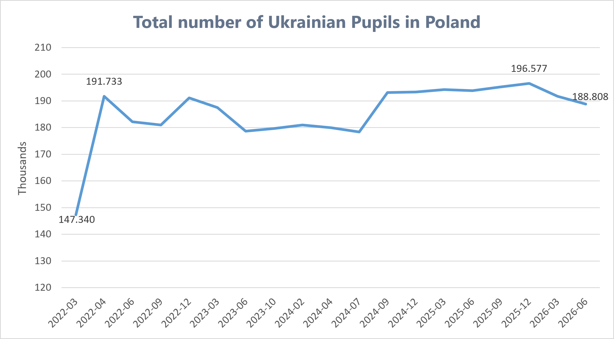
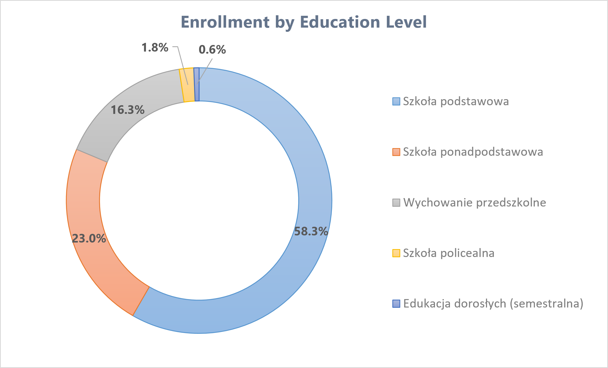
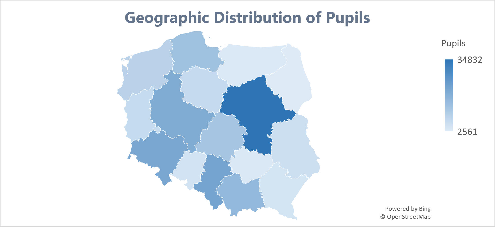
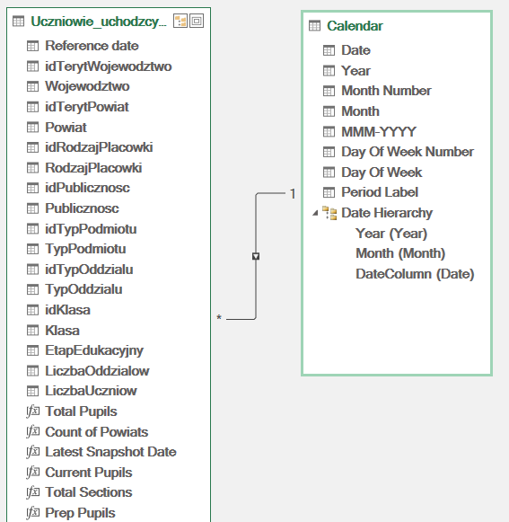

# Time-Series Analysis of Ukrainian Pupil Enrollment in the Polish Education System (2022–2026)

## Overview & Architecture
This research examines administrative microdata on displaced Ukrainian refugee pupils enrolled in Poland, published by the **Ministry of National Education (MEN)** via the Educational Information System (**SIO**). The project consolidates 19 discrete longitudinal snapshots into an interactive analytical dashboard leveraging **Power Query**, **Power Pivot**, DAX measures, and dynamic Pivot visualizations.

To process over 228,000 records across 19 snapshot dates (2 to 3-month intervals), **Power Query** served as the ETL pipeline to clean and normalize the data—standardizing reporting cutoff points into a unified `Reference date`, grouping fragmented adult semester cohorts into an ISCED-aligned `EtapEdukacyjny` classification, and structuring school sectors. The data was loaded into **Power Pivot** to construct an analytical data model. Using explicit DAX measures (including `[Current Pupils]`, `[Pupil Growth %]`, `[% Public Pupils]`, and `[% Prep Classes]`), the model computes dynamic, context-aware aggregations driven by dashboard slicers across temporal, regional, and structural dimensions.

---

## Data Dictionary & Transformations

| Variable Group / Field | Original SIO Field | Data Type | Analytical Role & Applied Transformations |
| :--- | :--- | :--- | :--- |
| **Territorial Hierarchy** | `Wojewodztwo`, `Powiat` | Text / TERYT Key | NUTS-2 regions (16 voivodeships) and NUTS-4 counties or cities with county status (*miasta na prawach powiatu*). |
| **Governance & Integration** | `Publicznosc`, `TypOddzialu` | Text | School sector and class format (mainstream vs. preparatory). **Transformation:** Collapsed marginal artistic entities (~0.2%) into `niepubliczna` for a clean binary sector split. |
| **Institution & Grade Level** | `TypPodmiotu`, `Klasa` | Text | Granular school facility category and specific cohort/grade level. |
| **Volume Metrics** | `LiczbaUczniow`, `LiczbaOddzialow` | Integer | Micro-level additive counts for pupil enrollments and active school sections. |
| **Reference date** *(Engineered)* | `Reference date` | Date (`yyyy-mm-dd`) | **Standardized Date Dimension:** Unifies the 19 distinct SIO snapshot cutoffs (March 2022 – June 2026) to enable continuous time-series modeling. |
| **EtapEdukacyjny** *(Engineered)* | `EtapEdukacyjny` | Text | **ISCED-Aligned Stage:** Aggregates granular entity types into 5 standard tiers. Unifies 8 fragmented adult semester cohorts (`sem. I–VIII`) into `Edukacja dorosłych (semestralna)` to eliminate chart clutter. |

---

## Key Empirical Findings

### 1. Enrollment Dynamics & Scale
* **Initial Surge & Plateau (2022–2024):** Following the full-scale invasion on February 24, 2022, enrollments surged from 147,340 in March 2022 to 191,733 by April 2022. Over the subsequent two school years, enrollment stabilized within an operational plateau of ~178,000–182,000 pupils.
* **Policy Mandate & Peak (Autumn 2024 – 2026):** The September 2024 legislative reform conditioning the *800+* child allowance on verified attendance in the Polish school system triggered a secondary influx, lifting counts from 178,365 (July 2024) to 193,159 (September 2024). Enrollment peaked at 196,577 in December 2025 before settling at 188,808 by June 2026.



### 2. Educational Stage Breakdown (June 2026 Snapshot, N = 188,808)
* **Primary School (*Szkoła podstawowa*):** 58.3% (110,143 pupils) — forms the primary cohort.
* **Upper Secondary (*Szkoła ponadpodstawowa*):** 23.0% (43,366 pupils).
* **Preschool (*Wychowanie przedszkolne*):** 16.3% (30,761 pupils).
* **Post-Secondary & Adult Education:** 2.4% (4,538 pupils combined across *Szkoła policealna* and *Edukacja dorosłych*).



### 3. School Sector Dynamics
* **Public Dominance:** 86.3% (163,014 pupils) are educated in public municipal schools.
* **Non-Public Sector:** 13.7% (25,794 pupils) attend non-public and civic institutions, heavily concentrated in primary metropolitan centers (Warszawa, Wrocław, Kraków, Łódź, Bydgoszcz, and Poznań).
* **Preparatory Class Transition (*Oddziały przygotowawcze*):** After peaking in 2022 during the initial crisis response, enrollment in dedicated preparatory classes steadily reduced to ~1.3% by 2026, marking a broad systemic transition of displaced pupils into mainstream Polish classrooms.

### 4. Territorial Distribution
Over 60.4% of all enrolled Ukrainian pupils reside within just 5 voivodeships:
1. **Mazowieckie:** 34,832 pupils (18.4% national share)
2. **Śląskie:** 21,858 pupils (11.6%)
3. **Dolnośląskie:** 21,115 pupils (11.2%)
4. **Wielkopolskie:** 19,777 pupils (10.5%)
5. **Małopolskie:** 16,417 pupils (8.7%)

Eastern border regions (e.g., Podlaskie at 2,561 pupils and Podkarpackie at 4,565) show significantly lower absorption, reflecting internal onward migration toward Poland's primary metropolitan housing and labor markets.

<p align="center">
  
  <br>
  <sub><em>Figure 1: Territorial distribution of Ukrainian pupils by Voivodeship (June 2026 snapshot; source: SIO).</em></sub>
</p>

## SUMMARY

In conclusion, the longitudinal analysis demonstrates sustained structural stability in the numbers and proportions of Ukrainian pupils in Poland. Enrollment has consolidated predominantly within the public municipal school networks—with over 86% attending public schools—and remains heavily concentrated in Poland's primary metropolitan hubs, where primary school-age children consistently form the vast majority of the cohort. 

---

## Technical & Dashboard Architecture

```text
[Raw SIO Snapshots (228k+ records)]
        |
        v
[Power Pivot Data Model (DAX)] ---> [Slicers: Voivodeship / Sector / Educational level / Date]
        |
        v
[Calc_Tables Staging]
  |-- 4 KPI Cells (Single-Cell DAX Anchors)
  |-- 16-Row Static Geo Helper Grid (Map Chart Source)
  \-- Top-5 Voivodeship Multi-Period Matrix (Sparkline Source)
        |
        v
[Dashboard Sheet]
  |-- Tier 1: Header Banner & 4 Dynamic KPI Metric Cards
  |-- Tier 2: Interactive Slicer Navigation Bar
  |-- Tier 3: National Longitudinal Line Chart & Stage Breakdown Doughnut
  \-- Tier 4: Filled Geographic Map & Top-5 Longitudinal Sparkline Table
```



<sub>*Figure: Power Pivot Star Schema showing the central fact table (`Uczniowie_uchodzcy...`) linked via a 1-to-many relationship from the dedicated `Calendar` dimension table (`Calendar[Date]` &rarr; `[Reference date]`), accompanied by explicit DAX measures for dynamic metric calculation.*</sub>